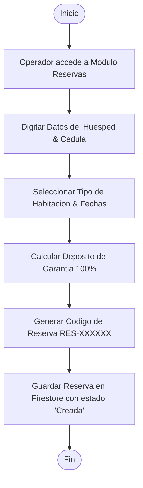
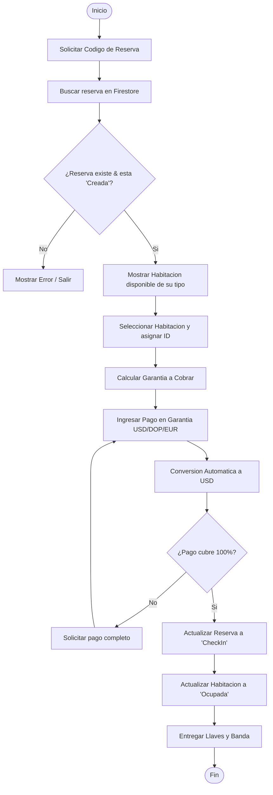
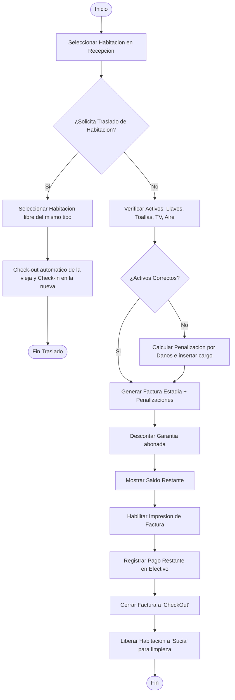

# Documentacion del Sistema de Gestion Hotelera - INFOTEP

Este documento contiene la guia paso a paso de configuracion en Firebase, la estructura de las colecciones, las reglas de seguridad recomendadas, y los diagramas de flujo de los procesos del negocio.

---

## 1. Guia Paso a Paso para Configurar Firebase

Para que el proyecto funcione en su totalidad, debe enlazarlo con su consola de Firebase. Siga estos pasos:

### Paso 1: Crear el Proyecto en Firebase
1. Ingrese a [Firebase Console](https://console.firebase.google.com/).
2. Haga clic en **Agregar proyecto** (o *Create a project*).
3. Escriba el nombre del proyecto (por ejemplo: `evaluacion-info`).
4. Habilite o deshabilite Google Analytics (es opcional para este examen, puede desactivarlo para ahorrar tiempo).
5. Haga clic en **Crear proyecto** y espere a que finalice.

### Paso 2: Habilitar Autenticacion (Authentication)
1. En el menu lateral izquierdo de Firebase, vaya a **Build** > **Authentication**.
2. Haga clic en **Comenzar** (*Get Started*).
3. En la pestaña **Metodo de inicio de sesion** (*Sign-in method*), seleccione **Correo electronico/Contrasena** (*Email/Password*).
4. Active el primer interruptor (Habilitado) y guarde los cambios.

### Paso 3: Crear la Base de Datos Cloud Firestore
1. En el menu lateral, vaya a **Build** > **Firestore Database**.
2. Haga clic en **Crear base de datos** (*Create database*).
3. Seleccione la ubicacion de la base de datos (por ejemplo, `nam5 (us-central)`).
4. Seleccione **Iniciar en modo de prueba** (esto le permitira leer/escribir mientras desarrolla) o **Iniciar en modo de produccion** (si usara las reglas de seguridad de abajo inmediatamente).
5. Haga clic en **Crear**.

### Paso 4: Configurar los Credenciales en el Codigo de Vue
Si necesita usar sus propias credenciales en lugar de las que estan configuradas en `src/firebase.js`:
1. En la consola de Firebase, haga clic en el icono de **Engrane** (Configuracion del proyecto) en la esquina superior izquierda.
2. Vaya a la seccion inferior de "Tus apps" y haga clic en el icono de **Web (`</>`)** para registrar una nueva aplicacion.
3. Copie el objeto `firebaseConfig` que le provee Firebase.
4. Abra su archivo [firebase.js](file:///C:/Users/delta/OneDrive/Pictures/proyectoinfotep/app/evaluacion-vue/src/firebase.js) y reemplace los valores en el objeto `firebaseConfig`.

---

## 2. Estructura y Poblacion de Colecciones en Cloud Firestore

A continuacion se describe la estructura de datos (esquema) de cada coleccion necesaria en Firestore y la forma en que se crea y puebla la informacion.

### A. Coleccion: `users`
* **Proposito**: Almacena el perfil y rol asignado a cada colaborador para validar el acceso por seguridad.
* **ID del Documento**: Debe ser el **UID de usuario** provisto por Firebase Authentication cuando se registra la cuenta.
* **¿Como se puebla?**: Se crea automaticamente cuando utilizas el formulario de registro en la interfaz de la aplicacion (`/register`).
* **Campos del Documento**:
  * `name` (String): Nombre completo del colaborador (ej. `"Juan Perez"`).
  * `email` (String): Correo electronico (ej. `"juan@hotel.com"`).
  * `role` (String): Rol del sistema. Valores validos: `"Gerente"`, `"Recepcion"`, `"Reservaciones"`.
  * `createdAt` (String): Marca de tiempo de registro en formato ISO.

### B. Coleccion: `rooms`
* **Proposito**: Control de ocupacion fisica de las habitaciones del hotel.
* **ID del Documento**: El numero fisico de la habitacion (ej. `"101"`, `"102"`, `"201"`, `"202"`, `"301"`, `"302"`).
* **¿Como se puebla?**: **La aplicacion Vue.js lo hace de forma automatica**. En cuanto el primer usuario inicia sesion e ingresa al Dashboard principal, el sistema detecta si la coleccion `rooms` esta vacia y siembra automaticamente las 6 habitaciones por defecto con sus tarifas correspondientes.
* **Campos del Documento**:
  * `type` (String): Tipo de habitacion. Valores validos: `"Simple"`, `"Doble"`, `"Suite"`.
  * `price` (Number): Tarifa por noche en USD (ej. `50` para Simple, `80` para Doble, `150` para Suite).
  * `status` (String): Estado operativo fisico. Valores: `"Disponible"`, `"Ocupada"`, `"Sucia"`.
  * `currentGuestResId` (String / Null): ID de la reserva del huesped hospedado actualmente. `null` si esta libre.
  * `currentGuestName` (String / Null): Nombre del huesped hospedado actualmente. `null` si esta libre.

### C. Coleccion: `reservations`
* **Proposito**: Historial de reservas de huespedes, fechas de alojamiento y cobros de garantia.
* **ID del Documento**: Generado automaticamente por Firestore (Auto-ID).
* **¿Como se puebla?**: Se crea automaticamente al llenar el formulario del modulo **Nueva Reservacion** y se va actualizando progresivamente durante el Check-in y Check-out.
* **Campos del Documento**:
  * `resNumber` (String): Codigo unico autogenerado (ej. `"RES-839210"`).
  * `guestName` (String): Nombre del huesped.
  * `guestId` (String): Documento de identidad / Cedula.
  * `startDate` (String): Fecha de entrada `YYYY-MM-DD`.
  * `endDate` (String): Fecha de salida `YYYY-MM-DD`.
  * `roomType` (String): Tipo reservado (`"Simple"`, `"Doble"`, `"Suite"`).
  * `roomNumber` (String / Null): Habitacion asignada durante el Check-in.
  * `guaranteeAmount` (Number): Costo de estadia al 100%.
  * `paidGuarantee` (Number / Null): Monto cobrado en efectivo durante el Check-in convertido a USD.
  * `status` (String): Estado de reserva. Valores: `"Creada"`, `"CheckIn"`, `"CheckOut"`, `"Cancelada"`.
  * `services` (Map): Servicios opcionales contratados. Campos:
    * `internet` (Boolean): `true` / `false` (costo fijo de `$10` USD).
    * `breakfast` (Boolean): `true` / `false` (costo de `$15` USD por persona/dia).
  * `createdAt` (String): Fecha ISO de creacion de reserva.
  * `checkInTime` (String / Null): Marca de tiempo del Check-in.
  * `checkoutTime` (String / Null): Marca de tiempo del Check-out.
  * `totalAmount` (Number / Null): Monto consolidado total facturado al salir.
  * `checkoutPayment` (Number / Null): Monto abonado al cerrar factura.
  * `paymentStatus` (String / Null): Estado final de factura (ej. `"Pagado"`).
  * `assetVerification` (Map / Null): Estado de los activos revisados al salir. Contiene:
    * `keys` (String): `"Correcto"`, `"Dañado"` o `"Faltante"`.
    * `towels` (String): `"Correcto"`, `"Dañado"` o `"Faltante"`.
    * `tv` (String): `"Correcto"`, `"Dañado"` o `"Faltante"`.
    * `ac` (String): `"Correcto"`, `"Dañado"` o `"Faltante"`.
  * `assetDamageCharge` (Number / Null): Cargo extra de penalidad cobrado al salir.

---

## 3. Reglas de Seguridad de Cloud Firestore

Para cumplir con el **Atributo del Sistema: Seguridad**, configure las siguientes reglas en su consola de Firebase.

1. Vaya a su consola de Firebase > **Firestore Database**.
2. Haga clic en la pestaña **Reglas** (*Rules*).
3. Pegue el siguiente bloque de codigo y haga clic en **Publicar** (*Publish*):

```javascript
rules_version = '2';

service cloud.firestore {
  match /databases/{database}/documents {
  
    // Funcion auxiliar para obtener el rol del usuario logueado
    function getUserRole() {
      return get(/databases/$(database)/documents/users/$(request.auth.uid)).data.role;
    }
    
    // Reglas para la coleccion 'users'
    match /users/{userId} {
      allow read: if request.auth != null;
      allow write: if request.auth != null && request.auth.uid == userId;
    }
    
    // Reglas para la coleccion 'rooms'
    match /rooms/{roomId} {
      allow read: if request.auth != null;
      allow write: if request.auth != null && (
        getUserRole() == 'Gerente' || 
        getUserRole() == 'Recepción' || 
        getUserRole() == 'Recepcion'
      );
    }
    
    // Reglas para la coleccion 'reservations'
    match /reservations/{resId} {
      allow read: if request.auth != null;
      allow write: if request.auth != null && (
        getUserRole() == 'Gerente' || 
        getUserRole() == 'Recepción' || 
        getUserRole() == 'Recepcion' || 
        getUserRole() == 'Reservaciones'
      );
    }
  }
}
```

---

## 4. Diagramas de Flujo de Procesos (Mermaid)

### A. Proceso de Reservaciones


### B. Proceso de Check-in (Entrada)


### C. Proceso de Check-out (Salida) y Traslados

